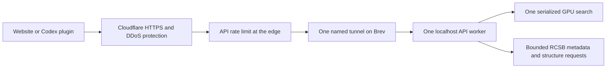

# PhotoProt operations and safety

Deployed and checked 20 September 2026. This is an operational hardening review,
not a penetration-test certification or a guarantee against every attack.



There are only two PhotoProt runtime services: `photoprot-api` and
`photoprot-tunnel`. The website is served by that same API process. GitHub stores
the plugin/reproduction materials but is not in the inference request path.
Neither a laptop process nor Modal is needed. No Redis, worker queue service,
database, Kubernetes, autoscaling or paid gateway was added.

## Controls

| Layer | Enforced limit or boundary |
|---|---|
| Cloudflare | HTTP redirects to HTTPS; minimum TLS 1.2; proxied domains, automatic network/TLS/HTTP DDoS protection; `/api/` rate rule: 20 requests per IP per 10 seconds, block for 10 seconds |
| Exposure | API listens only on `127.0.0.1:8000`; old quick tunnel stopped; only the named tunnel remains |
| Host | Firewall default denies incoming traffic. SSH is key-only. Existing Brev management SSH rules are preserved |
| Search per client | Token bucket: burst 3, refill 10/minute; IPv6 addresses grouped by /64 |
| Search across all clients | Token bucket: burst 6, refill 30/minute |
| Other API calls | Per client burst 30/refill 120/minute; global burst 100/refill 600/minute |
| Admission | At most 3 uploads/searches, 1 GPU operation, 24 admitted HTTP requests; Uvicorn also limits concurrency to 32 |
| Upload | 10 MiB, PNG/JPEG/WebP, 20 million pixels, 15-second body deadline; oversized streamed bodies rejected before extending buffer |
| Waiting for GPU | 10 seconds maximum; cancellation keeps the lock until the inference thread actually finishes |
| Outbound data | Indexed PDBs plus hero 1UBQ only; 8 connections; 32 coalesced metadata jobs and 4 structure jobs; 20-second overall deadlines |
| Caches | Structures: 64 MiB RAM, no new disk cache; metadata: 2,048 records; CSV: 128 results with one-hour access expiry; client rate state: at most 10,000 identities with ten-minute idle expiry |
| Process | API: 8 GiB RAM maximum, 4 CPU cores quota, 128 tasks; tunnel: 512 MiB RAM and 1 CPU core quota |
| Filesystem | Read-only system/home views, private temp directory, no privilege elevation; API cannot access configured SSH/tunnel credential paths |
| Provenance | Checkpoint and full index SHA-256 checked before readiness; weights-only checkpoint load; offline model loading |
| Browser | Host allowlist, cross-site POST rejection, HSTS, frame denial, MIME-sniff protection; plugin does not follow redirects or retry image uploads automatically |
| Logging | System journal with per-service log-rate bounds; uploaded image bodies and embeddings are not logged by the application |

Limits are implemented for **one worker**. Do not increase Uvicorn worker count:
that duplicates the GPU/index and creates independent rate counters. Shared
network users share an IP budget. A distributed attacker can still exhaust the
global budget and cause legitimate users to receive 429/503; the budget protects
resources, not guaranteed availability. Cloudflare edge counting can be delayed
and distributed; the application provides the independent global ceiling.

Do not enable blanket browser challenges/Bot Fight Mode for the API without
checking the Python plugin: it cannot solve JavaScript challenges.

## Routine commands on Brev

```sh
sudo systemctl status photoprot-api photoprot-tunnel
curl -fsS http://127.0.0.1:8000/api/health
sudo journalctl -u photoprot-api -u photoprot-tunnel --since '15 minutes ago' --no-pager
sudo systemctl restart photoprot-api
```

Emergency public shutoff (retains all model/data files):

```sh
sudo systemctl stop photoprot-tunnel
# Restore public access:
sudo systemctl start photoprot-tunnel
```

To pause searches while retaining the website, set `PHOTOPROT_SEARCH_ENABLED=0`
in `/etc/photoprot.env` using `sudoedit`, then restart `photoprot-api`.
Change it to `1` and restart to restore searches. The env file is optional.

`webapp/launch.py` and `webapp/publish_preview.py` now start these same services;
they cannot create detached duplicate workers or temporary public tunnels.

The deployment backup is at
`/home/shadeform/photoprot/data/service/hardening-backup-20260920`.
Use it only for a diagnosed rollback; rolling back removes these protections.

## Verification and remaining work

- Twelve isolated tests cover admission/refill/global limits, trusted proxy
  identity, slow/oversized streaming uploads, queue deadlines, cancellation,
  outbound deduplication and bounded caching.
- Public application probe: three invalid image responses (400), then 429 with
  Retry-After. No GPU inference was needed for this check.
- Bounded public health probe reached Cloudflare's independent 429 response.
- Fresh plugin inference still returns 20 entries, with public example 3I3W
  ranked first at 0.936663806438446.
- Service settings, firewall and key-only SSH were inspected on the live host.

The targeted Python dependency audit flags **PYSEC-2025-194 / CVE-2025-3000** in
PyTorch 2.11.0. The reviewed advisory concerns local `torch.jit.script` usage;
the image API does not accept Python/TorchScript/model uploads or invoke that
compiler. Production sets `PYTORCH_JIT=0`. This is a mitigation, not a package
upgrade or a clean dependency-audit result. Upgrade the torch/torchvision pair
in a separate tested environment and compare frozen rankings before switching.
The audit covers selected runtime Python packages; it is not an OS, CUDA driver,
JavaScript dependency, provider or full supply-chain audit.

References: [PyTorch advisory](https://github.com/advisories/GHSA-rrmf-rvhw-rf47),
[Cloudflare rate limiting](https://developers.cloudflare.com/waf/rate-limiting-rules/),
[origin protection](https://developers.cloudflare.com/fundamentals/security/protect-your-origin-server/).

The single Brev machine is still a single point of failure; automatic restart
does not recover a deleted/stopped instance or a persistent GPU/host fault.
No unattended alerting service was added. Keep the domain registration renewed,
review Cloudflare traffic when abuse occurs, and repeat dependency/update checks
before extending the public preview. Provider retention and confidential-upload
guarantees remain unaudited.
